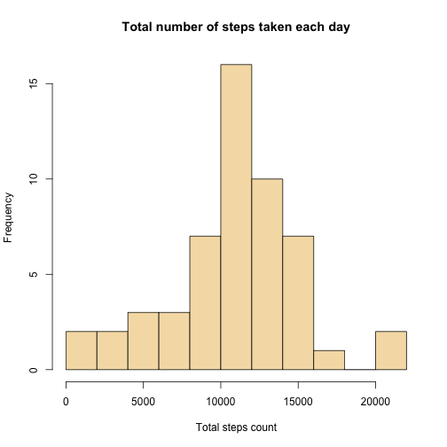
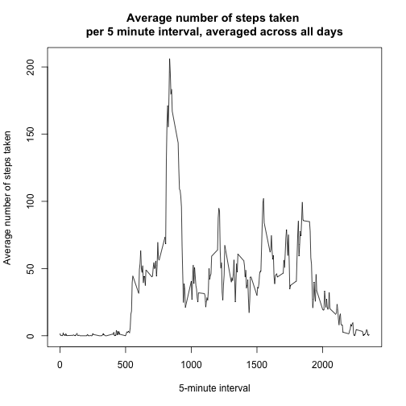
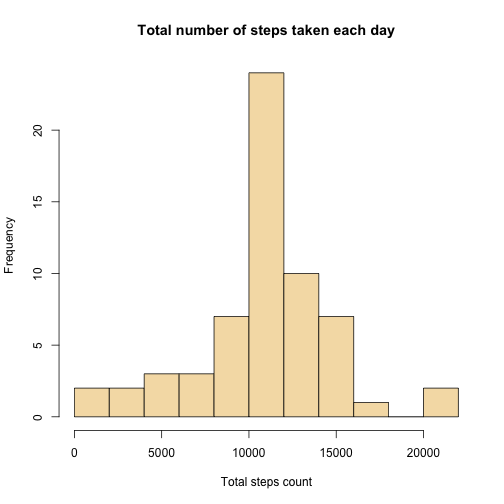
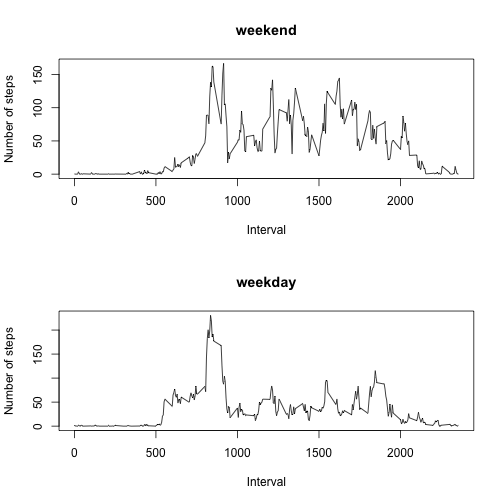

## Loading and preprocessing the data:
1. UnZIP file ```activity.zip```
    
    ```r
    unzip( "activity.zip" )
    ```

2. Load data from "activity.csv" to variable ```dat```:
    
    ```r
    dat <- read.csv( "activity.csv", colClasses=c("numeric", "character", "numeric"), na.string = "NA" )
    ```

3. Convert "date" column to Date datatype:
    
    ```r
    dat$date <- as.Date( dat$date, format = "%Y-%m-%d")
    ```

## What is mean total number of steps taken per day?
1. Calculate the total number of steps taken per day and save it to variable ```steps_days``` (NA values are being ignored):
    
    ```r
    steps_days <- aggregate( steps ~ date, data = dat, FUN = sum, na.rm = T )
    ```

2. Make a histogram of the total number of steps taken each day:
    
    ```r
    hist( steps_days$steps, breaks = 10, 
          xlab = "Total steps count", 
          main ="Total number of steps taken each day",
          col = "wheat")
    ```
    
     

3. Calculate and report the mean and median of the total number of steps taken per day
    + Calculate and report **mean** value:
    
    ```r
        mean( steps_days$steps )
    ```
    
    ```
    ## [1] 10766.19
    ```
    + Calculate and report **median** value:
    
    ```r
        median( steps_days$steps )
    ```
    
    ```
    ## [1] 10765
    ```
    
## What is the average daily activity pattern?
1. Make a time series plot (i.e. 𝚝𝚢𝚙𝚎 = "𝚕") of the 5-minute interval (x-axis) and the average number of steps taken, averaged across all days (y-axis)
    
    ```r
    # Save average steps per interval to variable "steps_interval"
    steps_interval <- aggregate( steps ~ interval, data = dat, FUN = mean, na.rm = T )
    
    plot( x = steps_interval$interval, y = steps_interval$steps, type ="l",
          xlab = "5-minute interval",
          ylab = "Average number of steps taken",
          main = "Average number of steps taken \nper 5 minute interval, averaged across all days")
    ```
    
     

2. Which 5-minute interval, on average across all the days in the dataset, contains the maximum number of steps?
    
    ```r
    steps_interval[ which.max( steps_interval$steps ), ]$interval
    ```
    
    ```
    ## [1] 835
    ```

## Imputing missing values

There are a number of days/intervals where there are missing values (coded as 𝙽𝙰). The presence of missing days may introduce bias into some calculations or summaries of the data.

1. Calculate and report the total number of missing values in the dataset (i.e. the total number of rows with 𝙽𝙰s)
    
    ```r
    sum( is.na(dat$steps) )
    ```
    
    ```
    ## [1] 2304
    ```

2. Devise a strategy for filling in all of the missing values in the dataset.  
    **Strategy used in this analysis**: Fill missing values with means for the same 5-minute interval.

3. Create a new dataset that is equal to the original dataset but with the missing data filled in.
    
    ```r
    # Copy initial dataset to new variable "dat_no_miss"
    dat_no_miss <- dat
    
    # Get indexes of missing values
    idxs <- is.na(dat_no_miss$steps)
    
    # Substitute NAs with the means for intervals (taken from previously constructed dataset "steps_intervals")
    dat_no_miss[ idxs, ]$steps <- sapply( dat_no_miss[ idxs, ]$interval, 
                                          function(x){ 
                                            steps_interval[ steps_interval$interval == x, ]$steps } )
    ```

4. Make a histogram of the total number of steps taken each day and Calculate and report the mean and median total number of steps taken per day. Do these values differ from the estimates from the first part of the assignment? What is the impact of imputing missing data on the estimates of the total daily number of steps?
    + Make a histogram of the total number of steps taken each day:
    
    ```r
    steps_days_no_miss <- aggregate( steps ~ date, data = dat_no_miss, FUN = sum, na.rm = T )
    hist( steps_days_no_miss$steps, breaks = 10, 
          xlab = "Total steps count", 
          main ="Total number of steps taken each day",
          col = "wheat")
    ```
    
     
    + Calculate and report the **mean** of total number of steps taken per day:
    
    ```r
        mean( steps_days_no_miss$steps )
    ```
    
    ```
    ## [1] 10766.19
    ```
    + Calculate and report the **median** of total number of steps taken per day:
    
    ```r
        median( steps_days_no_miss$steps )
    ```
    
    ```
    ## [1] 10766.19
    ```
    + Do these values differ from the estimates from the first part of the assignment?  
        + **Mean** is the same as the estimate from the first part. 
        + **Median** differs from the estimate from the first part (and is now equal to mean).
    + What is the impact of imputing missing data on the estimates of the total daily number of steps?  
    **After imputing missing data median increased a little and become equal to mean.**

## Are there differences in activity patterns between weekdays and weekends?
1. Create a new factor variable (wdays) in the dataset with two levels – “weekday” and “weekend” indicating whether a given date is a weekday or weekend day.
    
    ```r
    # Used wday instead of weekdays to get locale independant code
    wdays <- as.POSIXlt( dat_no_miss$date )$wday
    #Sundays and Saturdays have numbers 0 and 6
    wdays_names <- rep( "weekday", length( wdays ) )
    wdays_names[ wdays == 0 | wdays == 6 ] <- "weekend"
    dat_no_miss$wdays <- as.factor( wdays_names )
    ```

2. Make a panel plot containing a time series plot (i.e. 𝚝𝚢𝚙𝚎 = "𝚕") of the 5-minute interval (x-axis) and the average number of steps taken, averaged across all weekday days or weekend days (y-axis).
    
    ```r
    # Set 2-rows plotting
    par( mfrow = c( 2, 1) )
    
    # Make plot for weekends
    steps_interval_no_miss_weekend <- aggregate( steps ~ interval, 
                                                 data = dat_no_miss[ dat_no_miss$wdays == "weekend", ], 
                                                 FUN = mean )
    plot( x = steps_interval_no_miss_weekend$interval, y = steps_interval_no_miss_weekend$steps, type ="l",
          xlab = "Interval",
          ylab = "Number of steps",
          main = "weekend")
    
    # Make plot for weekdays
    steps_interval_no_miss_weekday <- aggregate( steps ~ interval, 
                                                 data = dat_no_miss[ dat_no_miss$wdays == "weekday", ], 
                                                 FUN = mean )
    plot( x = steps_interval_no_miss_weekday$interval, y = steps_interval_no_miss_weekday$steps, type ="l",
          xlab = "Interval",
          ylab = "Number of steps",
          main = "weekday")
    ```
    
     
